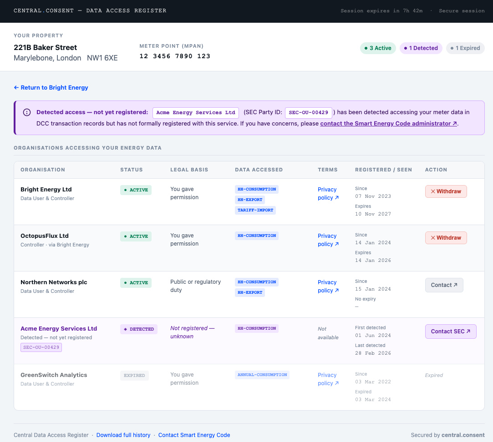
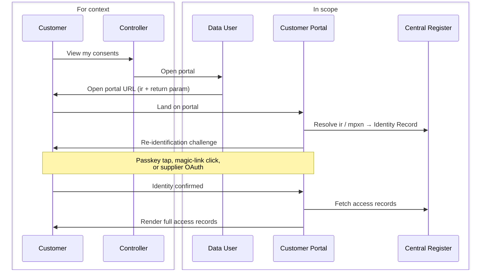
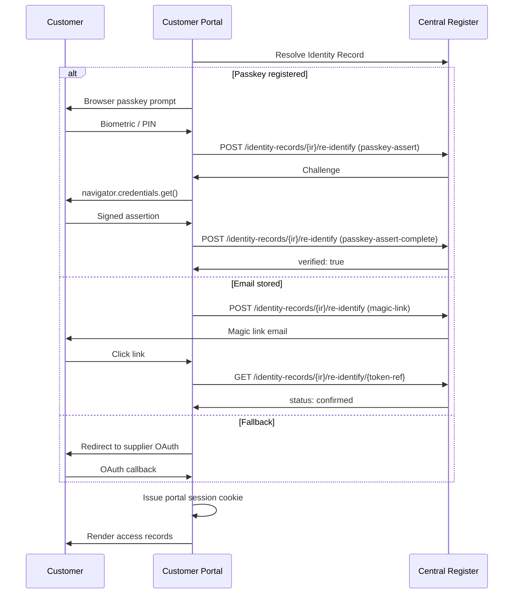
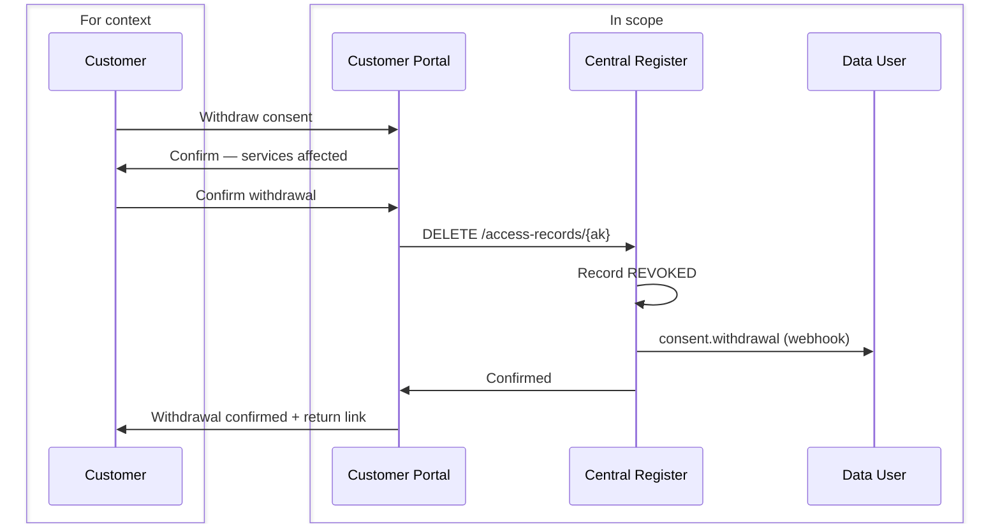

<Warning>
The Customer Consent Portal is a planned component of the Data Access Register. This document describes the proposed design for review and feedback. It can complement or replace the Data User in-app presentation of access records via [List Access Records](/api-reference/data-users/list-access-records-for-a-meter-point).

Key design principles:

- The portal is operated by the Central Register, not by individual Data Users
- Customers access it directly at a published URL, or via a link from any Data User application
- The portal authenticates the customer itself — no session token is issued by the Data User
- All consent management actions taken in the portal are reflected immediately in the register
- The portal cannot be embedded in an iframe by any party, including Data Users
- The portal is read-only with respect to granting new access — consent is always obtained by the Data User
</Warning>

## Overview

The Customer Consent Portal gives energy customers a single, centralised view of all organisations registered to access their meter data — including organisations identified through historic DCC transaction logs that have not yet formally registered.

Customers can:
- View all active, expired, revoked, and discovered access records for their meter point
- See the purpose, data types, legal basis, and expiry for each record
- Withdraw consent for any active consent-based record
- Download a copy of their access record history

The portal does not allow customers to grant new access. Consent is always obtained through the Data User's own application before being registered with the Central Register.

## Portal Design

The following mockup illustrates the proposed customer-facing interface.


<center><a href="https://htmlpreview.github.io/?https://gist.githubusercontent.com/matroderick/b17621732a008bc76177e3952ba66001/raw/portal-mockup.html" target="_blank" rel="noopener noreferrer">View interactive mockup ↗</a></center>

The interface shows:
- **Property header** — address, postcode, and formatted MPAN at the top, with summary pills showing the count of active, discovered, and expired records at a glance
- **Discovered notice** — a prominently signposted alert when DCC-detected organisations are present
- **Access records table** — all organisations in a single table, with status badges, plain-language legal basis, data type chips, terms links, registration and expiry dates, and either a **Withdraw** button (consent records) or a **Contact** link (non-consent and discovered records)
- **Expired records** — shown at reduced opacity for reference but with no available action
- **Return link** — shown when the customer arrived via a Data User link carrying a `return` parameter

## Accessing the Portal

### Via a Data User Link

Data Users link customers directly to the portal once they have authenticated the customer in their own application. No API call is required — the Data User constructs a portal URL carrying the customer's `ir` key (preferred) or `mpxn`, plus an optional `return` parameter.

```
https://portal.central.consent?ir={ir}&return={url}
https://portal.central.consent?mpxn={mpxn}&return={url}
```

The `ir` key is preferred as it resolves directly to the Identity Record without a lookup step. The `return` parameter must exactly match a URL pre-registered for the Data User's DUID — the portal validates it server-side on load and rejects unrecognised values.

The portal then authenticates the customer itself using the re-identification mechanisms on the Identity Record before showing any data:



The customer must successfully complete re-identification before any records are shown. A Data User cannot view the portal on a customer's behalf by constructing the URL themselves — the portal will present the re-identification challenge regardless of how the URL was formed.

### Direct Access

Customers may navigate directly to the portal at `https://portal.central.consent` without a Data User link. They enter their MPAN or registered email address and the portal initiates the same re-identification flow.

<Note>Direct access via email lookup requires an email address to be stored on the customer's Identity Record. Customers whose Data User has not registered an email can still access the portal directly by entering their MPAN and completing supplier OAuth authentication.</Note>

## Authentication — Re-identification Flow

The portal always authenticates the customer against their Identity Record before issuing a portal session. Three mechanisms are supported, tried in order of preference:

| Method | Condition | Customer experience |
|--------|-----------|-------------------|
| **Passkey** | At least one passkey credential registered on the Identity Record | Browser biometric prompt — one tap |
| **Magic link** | Email address stored on the Identity Record | Link sent to stored email; customer clicks to confirm |
| **Supplier OAuth** | Fallback — no passkey or email on record | Redirected to supplier login, then back to portal |

The re-identification challenge is initiated against the Identity Record resolved from the `ir` or `mpxn` parameter. For direct access, the portal looks up the Identity Record after the customer enters their MPAN or email.



## Session Model

Once re-identification is confirmed the portal issues its own session — a server-side session stored as an `httpOnly`, `Secure`, `SameSite=Strict` cookie on the portal domain. It is not accessible to JavaScript and never exposed to the Data User.

| Property | Value |
|----------|-------|
| Session cookie | `httpOnly`, `Secure`, `SameSite=Strict` — not accessible to JavaScript |
| TTL | Up to 8 hours, renewable on activity |
| Scope | Bound to the single MPxN resolved at re-identification |
| Access | Never exposed to the originating Data User |

A customer cannot navigate to another customer's records within the same portal session.

## What the Customer Sees

The portal always shows the full access record view — customers can see and manage all their records regardless of which Data User linked them to the portal.

### Access Record List

| State | Description | Action available |
|-------|-------------|-----------------|
| `ACTIVE` | Currently authorised access | Withdraw (consent records only) |
| `DISCOVERED` | Detected from DCC historic logs — organisation not yet registered | None — informational only |
| `EXPIRED` | Access period has ended | None |
| `REVOKED` | Previously withdrawn or removed | None |

For each record the customer can see:
- Organisation name and contact URL
- Purpose of data access
- Data types covered
- Legal basis in plain language (see table below)
- Date access was registered and expiry date
- For `DISCOVERED` records: first and last observed access dates

### Plain Language Legal Basis Labels

| API value | Displayed to customer |
|-----------|----------------------|
| `uk-consent` | You gave permission |
| `uk-explicit-consent` | You gave specific permission |
| `uk-legitimate-interests` | Legitimate business interest |
| `uk-public-task` | Public or regulatory duty |
| `uk-legal-obligation` | Legal requirement |
| `uk-contract` | Your service contract |

## Withdrawing Consent

Customers can withdraw consent for any record where the legal basis is `uk-consent` or `uk-explicit-consent` and the state is `ACTIVE`.

<Warning>
Withdrawing consent may affect services you currently receive from the organisation. Before confirming, the portal will display:

- Which services may be affected
- That the organisation will be notified immediately
- That historic data already collected is not deleted — only future access is stopped
</Warning>

On confirmation, the portal calls `DELETE /access-records/{ak}` using its own server-side credentials. The record transitions to `REVOKED` state immediately. The Data User then receives a `consent.withdrawal` webhook in real time.



If the customer arrived via a Data User link carrying a `return` parameter, the portal shows a return link with `?dar-action=withdrawn&ak={ak}` appended, allowing the Data User application to update its UI without waiting for the webhook.

<Note>Non-consent records (`uk-legitimate-interests`, `uk-public-task`, `uk-legal-obligation`, `uk-contract`) cannot be withdrawn by the customer through the portal. The customer is shown the organisation's contact URL and advised to raise a dispute directly, with Ofgem as a further escalation route.</Note>

## Security

**The portal cannot be embedded in a frame.**
All portal responses include `X-Frame-Options: DENY` and `Content-Security-Policy: frame-ancestors 'none'`. Any attempt to load the portal inside an iframe — including by the Data User's own application — fails silently in the browser.

**The MPxN is never in the session.**
Once re-identification is complete, the MPxN is held only in the portal's server-side session. It does not appear in browser history, server logs, or referrer headers after the initial page load.

**Revocation is server-to-server.**
The portal calls `DELETE /access-records/{ak}` using its own privileged credentials, not any credential supplied by the Data User or customer. The customer cannot craft API requests directly.

**Portal sessions are bound to a single MPxN.**
A customer cannot navigate to another customer's records within the same portal session, regardless of what they supply in the URL.

**`return` parameter is allowlisted.**
The portal only links back to URLs pre-registered for the DUID associated with the Identity Record. The portal resolves the DUID from the Identity Record server-side and validates the `return` parameter against the Data User's registered callback URLs. Unrecognised values are silently ignored — the portal renders without a return link.

**Data Users cannot impersonate customers.**
The portal always requires the customer to complete re-identification regardless of how the URL was formed. A Data User constructing a portal URL with a customer's `ir` or `mpxn` will be presented with a re-identification challenge they cannot complete on the customer's behalf.

## Change Log

| Version | Date | Summary |
|---------|------|---------|
| 0.0.12 | 2026-03-24 | Removed `POST /customer-sessions` endpoint. Portal now uses direct URL linking with `ir`/`mpxn` + `return` parameters. Customer re-identification via passkey, magic link, or OAuth is required before portal session is issued. |
| 0.0.10 | 2026-03-19 | Added `purpose` field, iframe blocking, `consent.withdrawal` webhook, `dar-action` return signal, and security controls section. |
| 0.0.9 | 2026-03-19 | Initial design draft. |
