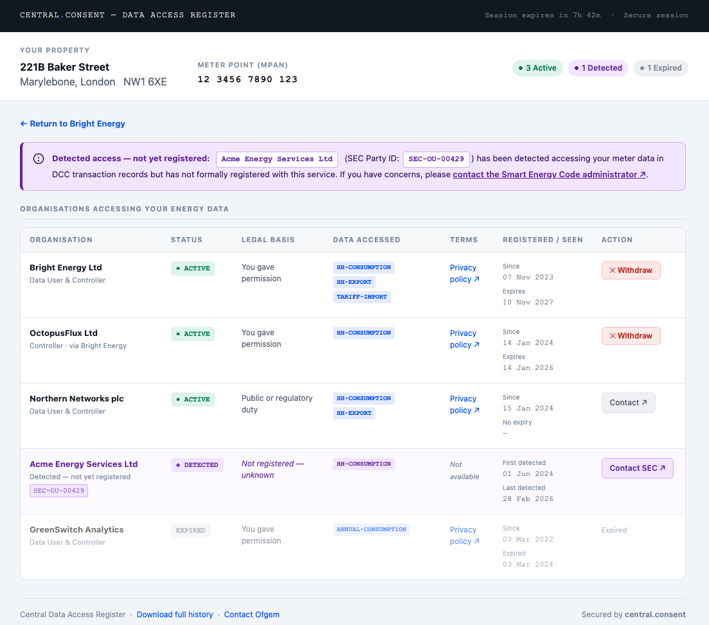
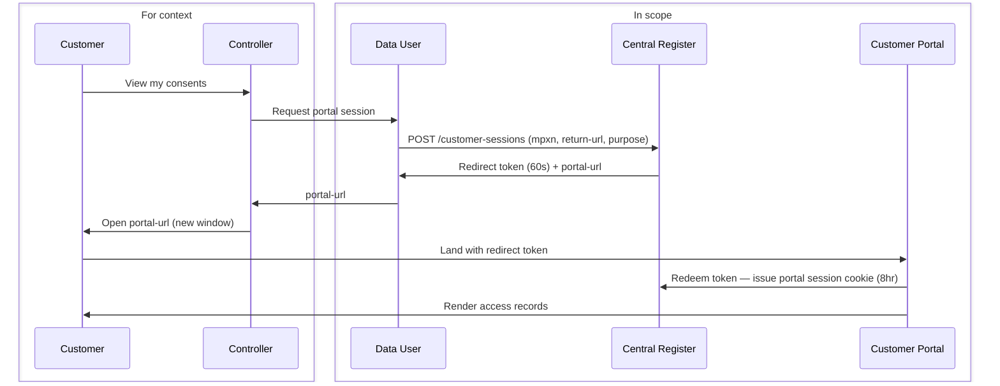
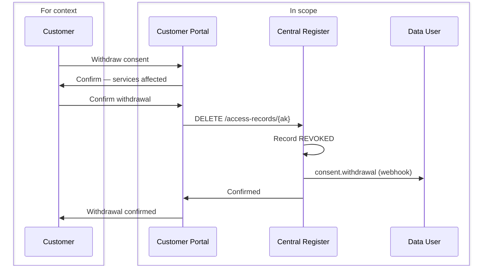

<Warning>
The Customer Consent Portal is a planned component of the Data Access Register. This document describes the proposed design for review and feedback. This can compliment or replace the Data User in app presentation of the access information [List Records](/api-reference/data-users/list-access-records-for-a-meter-point)

Key design principles:

- The portal is operated by the Central Register, not by individual Data Users
- Customers access it via a redirect from any Data User application, or directly via a published URL
- All consent management actions taken in the portal are reflected immediately in the register
- The portal cannot be embedded in an iframe by any party, including Data Users
- The portal is read-only with respect to granting new access — consent is always obtained by the Data User
</Warning>

## Overview

The Customer Consent Portal gives energy customers a single, centralised view of all organisations registered to access their meter data — including organisations identified through historic DCC transaction logs that have not yet formally registered.

Customers can:
- View all active, expired, revoked, and discovered access records for their meter point
- See the purpose, data types, legal basis, and expiry for each record
- Withdraw consent for any active consent-based record
- Download a copy of their access record history

The portal does not allow customers to grant new access. Consent is always obtained through the Data User's own application before being registered with the Central Register.

## Portal Design

The following mockup illustrates the proposed customer-facing interface.

The interface shows:
- **Property header** — address, postcode, and formatted MPAN at the top, with summary pills showing the count of active, discovered, and expired records at a glance
- **Discovered notice** — a prominently signposted alert when DCC-detected organisations are present
- **Access records table** — all organisations in a single table, with status badges, plain-language legal basis, data type chips, terms links, registration and expiry dates, and either a **Withdraw** button (consent records) or a **Contact** link (non-consent and discovered records)
- **Expired records** — shown at reduced opacity for reference but with no available action
- **Return link** — links back to the originating Data User application

## Accessing the Portal

### Via a Data User Application

Data Users redirect customers to the portal after authenticating them on their own platform. The Data User calls `POST /customer-sessions` to obtain a short-lived redirect token and portal URL, then opens it in a new browser window.

The redirect token is single-use and expires in 60 seconds — it exists only to survive the browser redirect. On redemption the portal issues its own session with a TTL of up to 8 hours, renewable on activity. The Data User never has access to the portal session.

### Direct Access

Customers may also navigate directly to the portal at `https://portal.central.consent`. In this case they authenticate using their energy account credentials via their supplier, using a standard OAuth 2.0 authorisation code flow against the supplier's identity provider.

<Note>Direct access requires the customer's supplier to be integrated with the portal's identity federation. This is a phased capability — Data User redirect access is available from launch; direct access follows as supplier integration is completed.</Note>

## Session Model

| Token | Issued by | TTL | Purpose |
|-------|-----------|-----|---------|
| Redirect token (`cst_...`) | `POST /customer-sessions` | 60 seconds, single-use | Survives the browser redirect |
| Portal session | Portal on redirect token redemption | Up to 8 hours, renewable | Authenticates the customer within the portal |

The portal session is stored as an `httpOnly`, `Secure`, `SameSite=Strict` cookie on the portal domain. It is never exposed to the Data User application or accessible via JavaScript.

## Purpose and Scope

When calling `POST /customer-sessions`, the Data User declares a `purpose`:

| Value | Portal behaviour |
|-------|-----------------|
| `view` | Customer can browse records. Withdrawal controls are not shown. |
| `manage` | Customer can browse records and withdraw consent for active consent-based records. |

The portal enforces the declared purpose — a Data User cannot cause withdrawal controls to appear by manipulating the browser or the redirect URL. The purpose is recorded in the audit trail.

## What the Customer Sees

### Access Record List

The portal displays all access records for the customer's meter point, grouped by state:

| State | Description | Action available |
|-------|-------------|-----------------|
| `ACTIVE` | Currently authorised access | Withdraw (consent records, `manage` sessions only) |
| `DISCOVERED` | Detected from DCC historic logs — organisation not yet registered | None — informational only |
| `EXPIRED` | Access period has ended | None |
| `REVOKED` | Previously withdrawn or removed | None |

For each record the customer can see:
- Organisation name and contact URL
- Purpose of data access
- Data types covered
- Legal basis in plain language (see table below)
- Date access was registered and expiry date
- For `DISCOVERED` records: first and last observed access dates

### Plain Language Legal Basis Labels

| API value | Displayed to customer |
|-----------|----------------------|
| `uk-consent` | You gave permission |
| `uk-explicit-consent` | You gave specific permission |
| `uk-legitimate-interests` | Legitimate business interest |
| `uk-public-task` | Public or regulatory duty |
| `uk-legal-obligation` | Legal requirement |
| `uk-contract` | Your service contract |

## Withdrawing Consent

Customers can withdraw consent for any record where the legal basis is `uk-consent` or `uk-explicit-consent` and the state is `ACTIVE`, provided the session was created with `purpose: manage`.

<Warning>
Withdrawing consent may affect services you currently receive from the organisation. Before confirming, the portal will display:

- Which services may be affected
- That the organisation will be notified immediately
- That historic data already collected is not deleted — only future access is stopped
</Warning>

On confirmation, the portal calls `DELETE /access-records/{ak}` using its own server-side credentials. The record transitions to `REVOKED` state immediately. The Data User then receives a `consent.withdrawal` webhook — this is fired in real time after the record is revoked, not as a request for permission.

After withdrawal, the portal redirects the customer to the Data User's `return-url` with `?dar-action=withdrawn&ak={ak}` appended, allowing the application to update its UI without waiting for the webhook.

<Note>Non-consent records (`uk-legitimate-interests`, `uk-public-task`, `uk-legal-obligation`, `uk-contract`) cannot be withdrawn by the customer through the portal. The customer is shown the organisation's contact URL and advised to raise a dispute directly, with Ofgem as a further escalation route.</Note>

## Security

**The portal cannot be embedded in a frame.**
All portal responses include `X-Frame-Options: DENY` and `Content-Security-Policy: frame-ancestors 'none'`. Any attempt to load the portal inside an iframe — including by the Data User's own application — fails silently in the browser.

**The MPxN is never in the URL.**
The redirect token is opaque. The MPxN is resolved server-side on redemption and held only in the portal's server-side session. It does not appear in browser history, server logs, or referrer headers.

**Revocation is server-to-server.**
The portal calls `DELETE /access-records/{ak}` using its own privileged credentials, not any credential supplied by the Data User or customer. The customer cannot craft API requests directly.

**Portal sessions are bound to a single MPxN.**
A customer cannot navigate to another customer's records within the same portal session, regardless of what they supply in the URL.

**`return-url` is whitelisted.**
The portal only links back to URLs pre-registered by the Data User. Unregistered return URLs are rejected at `POST /customer-sessions` with `400`. The portal will not redirect to an arbitrary URL.

**Rate limiting on session creation.**
The register monitors `POST /customer-sessions` call patterns per Data User. Sessions created without corresponding redemption activity are flagged. Anomalous patterns trigger alerts and may result in temporary suspension of session creation for that Data User.

## Change Log

| Version | Date | Summary |
|---------|------|---------|
| 0.0.10 | 2026-03-19 | Added `purpose` field, iframe blocking, `consent.withdrawal` webhook, `dar-action` return signal, and security controls section. |
| 0.0.9 | 2026-03-19 | Initial design draft. |
