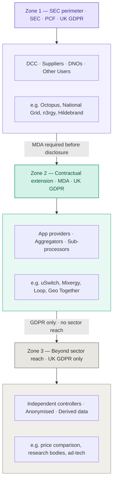

## Overview

This framework establishes three concentric governance zones for smart meter personal data. Each zone has a distinct legal basis, defined parties, and a justified boundary. The objective is to extend meaningful data protection obligations one step beyond the SEC perimeter — through contractual rather than regulatory instruments — while drawing a clear and honest line beyond which only UK GDPR applies.

> **Note**: The Data Access and Privacy Framework (DAPF) establishes purpose restrictions that may exceed UK GDPR requirements in certain contexts. While it does not impose direct obligations on SEC parties, it should be treated as material policy context when assessing the appropriateness of downstream data sharing.

## Zone 1 — Inside the SEC perimeter
**Direct parties**: DCC, Suppliers, DNOs/DSOs, Other Users, accredited intermediaries (including DCC service agents and CAD-layer parties who are themselves SEC parties).

**Applicable obligations**: SEC (including the Privacy Control Framework (PCF)) + UK GDPR, cumulatively. The PCF is the privacy obligation framework within the SEC applicable to all parties — a valid UK GDPR lawful basis does not override a PCF purpose restriction.

**Enforcement instruments**:
- SEC, including PCF obligations
- Ofgem direct regulatory action
- ICO enforcement under UK GDPR
- Dual breach notification: 72 hours to ICO (UK GDPR Article 33) and notification to the SEC Privacy Sub-committee (PSC) under SEC breach provisions
- The Data Access Register (DAR) operates as a Zone 1 instrument, recording consent grants, purpose commitments, and downstream disclosure permissions

**Boundary justification**: Parties in Zone 1 have signed the SEC or operate under Ofgem licence. The obligations are the quid pro quo for market access.

## Zone 1 → Zone 2: The first boundary
This line may only be crossed with a **Minimum Data Agreement (MDA)** in place. The SEC Party must execute an MDA before disclosing personal smart meter data to any downstream recipient. The obligation sits on the SEC Party — not the recipient, who has not consented to SEC governance and cannot reasonably be required to seek SEC accreditation to receive a data feed. The DAR holds registration details of onward parties.

<Note>The **Minimum Data Agreement (MDA)** is an extension to the obligations on SEC Parties who contract with other organisations that wish to access personal data.</Note>

### MDA minimum terms (flowing down from Zone 1 obligations)
| Term | Requirement |
|---|---|
| Purpose limitation | Downstream use must be compatible with the original consent or lawful basis |
| Security standard | Appropriate security standards with documented controls; annual audit right reserved by the SEC Party |
| Breach notification | Recipient must notify the SEC Party within 48 hours of discovery, enabling the SEC Party's own 72-hour ICO obligation and notification to the SEC Privacy Sub-committee (PSC) under SEC breach provisions |
| Onward disclosure | No further disclosure of personal smart meter data without written consent from the SEC Party and equivalent MDA terms imposed on the sub-recipient; onward disclosure to be registered in DAR |
| Retention | Limits mirroring the applicable PCF restrictions |
| Termination | SEC Party may terminate and require certified data deletion on MDA breach |

### What does not flow down
Full SEC accreditation requirements, SEC/DAR consumer-facing consent mechanics, and SEC governance obligations do not apply to Zone 2 recipients. Imposing these on a non-party would be disproportionate and practically unworkable.

### Reputational liability
If a Zone 2 party suffers a breach and the SEC Party can produce its MDA and demonstrate it exercised adequate due diligence, the reputational and regulatory line is defensible. If the SEC Party failed to impose or enforce MDA terms, residual Zone 1 liability is appropriate. The MDA forms part of the SEC Party's annual privacy audit cycle.

## Zone 2 — Contractual extension
**Parties**: App providers, ESCOs, flexibility aggregators, sub-processors (analytics platforms, cloud infrastructure), and HAN/CAD-layer OEMs not themselves SEC parties.

**Applicable obligations**:
- UK GDPR directly — Zone 2 parties are independent controllers or processors for their own purposes
- The MDA contractually — private law enforcement by the SEC Party
- No direct SEC enforcement reach

ICO retains full UK GDPR enforcement powers over any UK-established entity in Zone 2. The SEC Party retains private law rights via the MDA, including termination and notification obligations.

Where a Zone 2 party itself engages a sub-processor (for example, an app provider using a cloud analytics platform), the MDA onward disclosure term requires equivalent MDA terms to be imposed on that sub-processor. This creates a Zone 2 chain — it does not constitute a Zone 3 exit. The originating SEC Party's audit and termination rights should be capable of flowing through the chain.

## Zone 2 → Zone 3: The second boundary
This line is drawn by the **character of the data**, not the identity of the party holding it.

### Transformed or derived data
If a Zone 2 party derives a new dataset from smart meter consumption data — behavioural profiles, occupancy inference, asset identification — they become an independent controller of that derived dataset. The original consent does not extend to it. Article 5(1)(b) purpose limitation very likely prohibits use for purposes incompatible with the original energy management or billing purpose. The MDA should explicitly state that derived datasets require a fresh lawful basis and are not covered by the original consent grant.

### Genuinely anonymised data
Data that has been irreversibly anonymised to ICO standard exits UK GDPR scope entirely, and all flow-down obligations terminate. The risk is miscategorisation: pseudonymised data is not anonymous data, and sparse rural meter cohorts can be re-identified even at groups of three. The MDA should require the Zone 2 party to conduct and document an anonymisation assessment before claiming this exemption.

## Zone 3 — Beyond sector reach
**Parties**: Independent controllers processing for their own purposes; parties holding genuinely anonymised datasets; parties holding transformed or derived data with no connection to the original consent chain.

**Applicable obligations**: UK GDPR only, enforced directly by ICO. No SEC or contractual sector obligations apply.

Some data and some harms will reach Zone 3. The appropriate policy response is not to extend sector governance indefinitely — it is to ensure the Zone 1/2 boundary is sufficiently robust, and to communicate clearly that beyond Zone 2, consumers should treat their smart meter data like any other personal data and look to ICO, not Ofgem, for redress.

---

## Boundary justification summary

| Boundary | Basis | Instrument |
|---|---|---|
| Zone 1 perimeter | Privity — the SEC binds its own parties directly | SEC accession, Ofgem licence conditions |
| Zone 1 → Zone 2 | Proportionality — obligation on the SEC Party, not accreditation of the recipient | Minimum Data Agreement (MDA) |
| Zone 2 → Zone 3 | Data character — UK GDPR sufficiency for independent controllers is mature and enforced | UK GDPR Article 5, ICO anonymisation standard |

<Info>
## Multi-controller problem

Unlike financial services, smart meter data has multiple independent origination points. The DCC, suppliers, DNOs, and accredited Other Users all have direct legal access to meter data — none controls the others' data flows. This means a single-apex chain-of-trust model (as used in HIPAA) does not map cleanly. The MDA framework addresses this by placing the obligation on whichever Zone 1 party makes a specific downstream disclosure, rather than attempting to identify a single originating controller. Each disclosing party is responsible for its own MDA obligations regardless of how many other Zone 1 parties may also hold the same data.
</Info>
