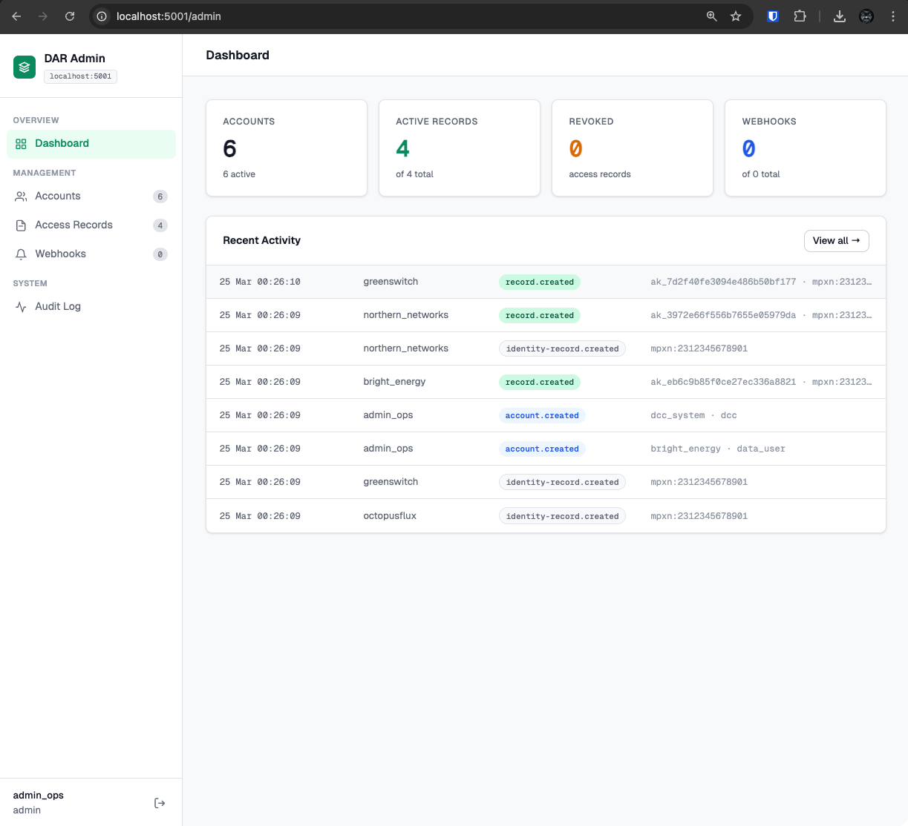
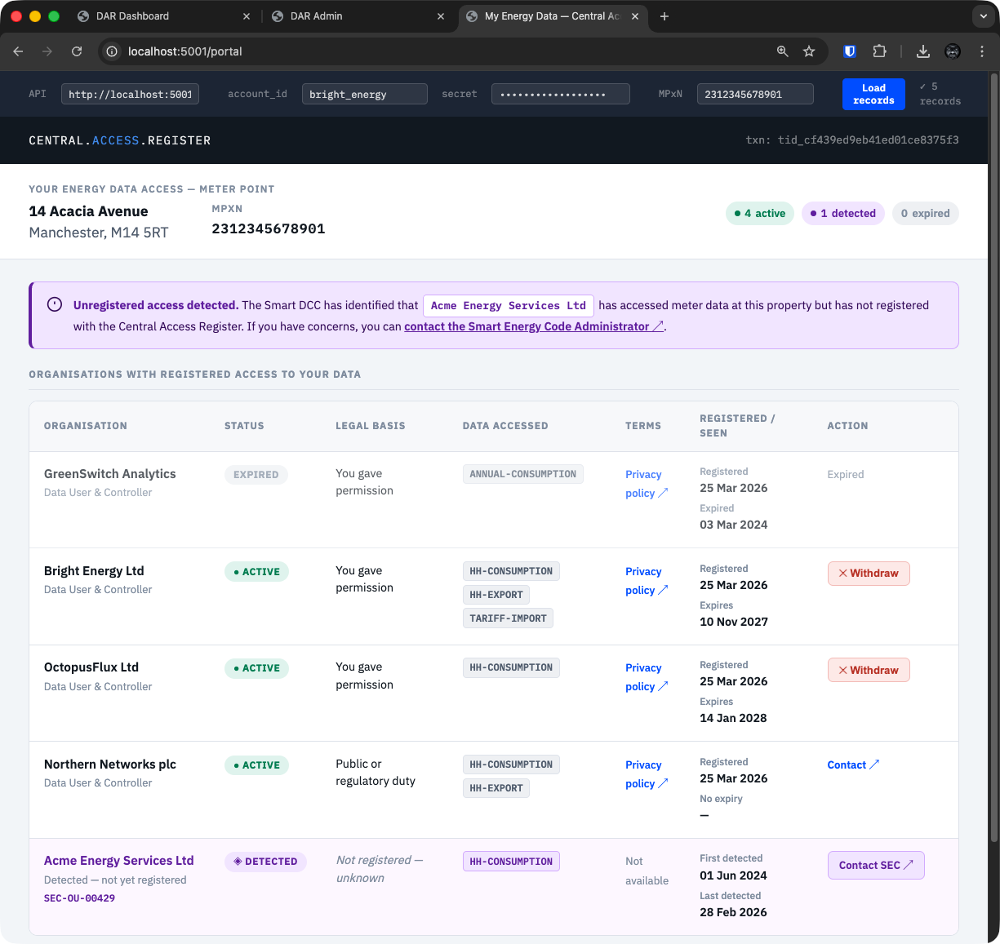
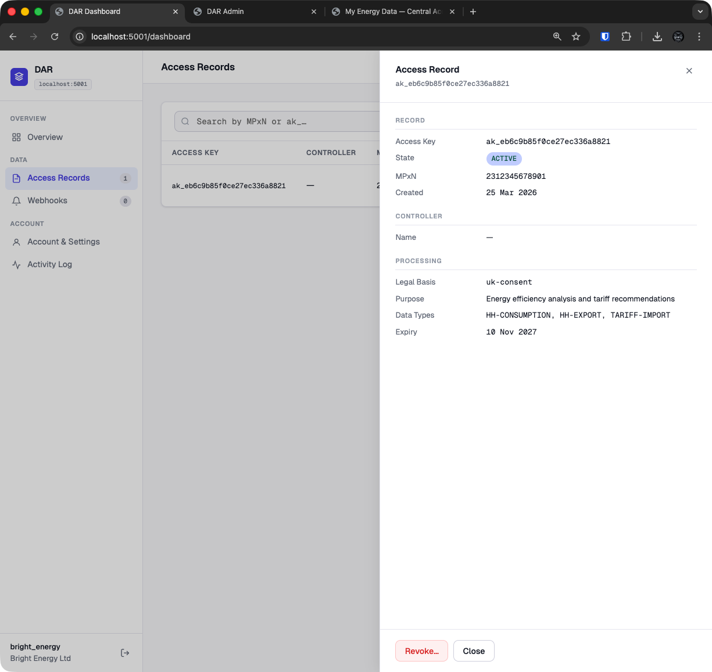

The reference implementation demonstrates the full Data Access Register in operation — a working API, three browser interfaces, and a realistic set of pre-seeded data covering every record state and legal basis. It is intended to illustrate both the technical approach and the industry problem it solves.

---

## The Problem It Solves

Today there is no central, auditable record of who is accessing customer energy meter data and under what legal basis. Consent is collected and stored bilaterally — each Data User holds their own records, in their own format, with no standardised structure and no cross-industry visibility. Customers have no single place to see who holds access to their data. Auditors have no reliable way to verify claims without sampling individual organisations.

The DAR addresses this by providing a single lightweight register that all Data Users write to and all parties can query — without replacing existing consent flows or requiring customers to interact with a new service unless they choose to.

---

## Key Design Principles

**Not just a consent register.** The register records access under any UK GDPR lawful basis — consent, legitimate interests, public task, legal obligation, or contract. A DNO accessing meter data under a statutory duty registers the same way as an energy supplier collecting customer consent. This means the register can provide complete coverage of data access across the industry, not just the consent-based slice.

**The register holds the registration, not the verification.** Data Users assert their legal basis. The register stores what it is told and makes it auditable — it does not re-verify consent or validate legal claims. This keeps the register lightweight and avoids it becoming a bottleneck in the consent flow.

**PII separation by design.** Customer identity and property details are held in a separate Identity Record, linked to the access record by reference. The unauthenticated endpoint used by Data Providers to verify an access key returns no PII at all — only the legal basis, data types, and controller identity needed to make an authorisation decision. This is a deliberate architectural choice to minimise the attack surface of the most-called endpoint in the system.

**Discovery without registration.** The DCC can submit records for organisations it detects accessing meter data that have not yet registered with the DAR. These discovered records are visible to customers for transparency but cannot be used to authorise data release — creating a structural incentive for organisations to register.

**Customer transparency is cross-industry.** A customer can see every organisation with registered access to their meter point in one place, regardless of which Data User registered it or which supplier they are currently with. This is only possible because the register is central.

---

## Central Admin Portal

The register operator's view across all Data Users.

A live dashboard showing the state of the register — accounts, active records, revocations, and webhooks. The audit log captures every event across all Data Users in real time: account creation, record registration, revocation, and identity events. This provides the kind of cross-industry audit trail that is impossible to achieve with bilateral arrangements — an auditor can verify any claim about any Data User without requesting records from the organisation under review.

---

## Customer Portal

What a customer sees when they ask who has access to their meter data.

A single view of every organisation with registered or detected access to the customer's meter point — regardless of which Data User registered it or what legal basis they hold. The demo shows all five record states simultaneously:

- Two active consent records with Withdraw buttons
- One active public task record (no withdrawal available — regulatory basis)
- One unregistered organisation detected by the DCC, surfaced for transparency
- One expired consent record retained for audit

Customers can withdraw consent directly. The record is revoked immediately and the Data User is notified by webhook. Critically, the customer reaches this view through any Data User's application — there is no requirement for them to know the register exists or navigate to it directly.

---

## Data User Dashboard

The self-service view for a registered Data User.

Each Data User sees their own access records, can manage webhook subscriptions, and can view their account details. The record drawer shows the full controller arrangement, processing purpose, data types, and expiry — with a revocation action available for active records.

Webhooks keep Data Users informed of lifecycle events without polling: consent withdrawal initiated by the customer via the portal, consent approaching expiry, and Change of Tenancy events from the DCC. Data Users can act on these events — revoking records, prompting renewals, or ceasing data collection — without any manual intervention from the register operator.

---

## What the Demo Shows Together

The three interfaces together demonstrate the central proposition: a single register that serves every party's needs from one data model.

- The **operator** has complete visibility and audit capability without depending on Data Users to self-report
- The **customer** has a single, honest view of who holds access to their data — including parties who have not yet registered
- The **Data User** has a clear record of their own registrations, lifecycle events, and obligations
- The **Data Provider** has an unauthenticated, PII-free verification endpoint they can call on every data request

None of this requires changes to existing consent flows, new customer-facing journeys, or significant integration overhead. The register sits alongside existing processes and adds auditability and transparency that the industry currently lacks.

---

## Try It Yourself

The full reference implementation is available to download and run locally. It includes the API, all three browser interfaces, a Docker Compose stack, and a seed script that recreates the demo data shown here.

- **Source:** [github.com/AuthEnergy/dar](https://github.com/AuthEnergy/dar)
- **Setup guide:** [DEMO.md](https://github.com/AuthEnergy/dar/blob/main/DEMO.md)
