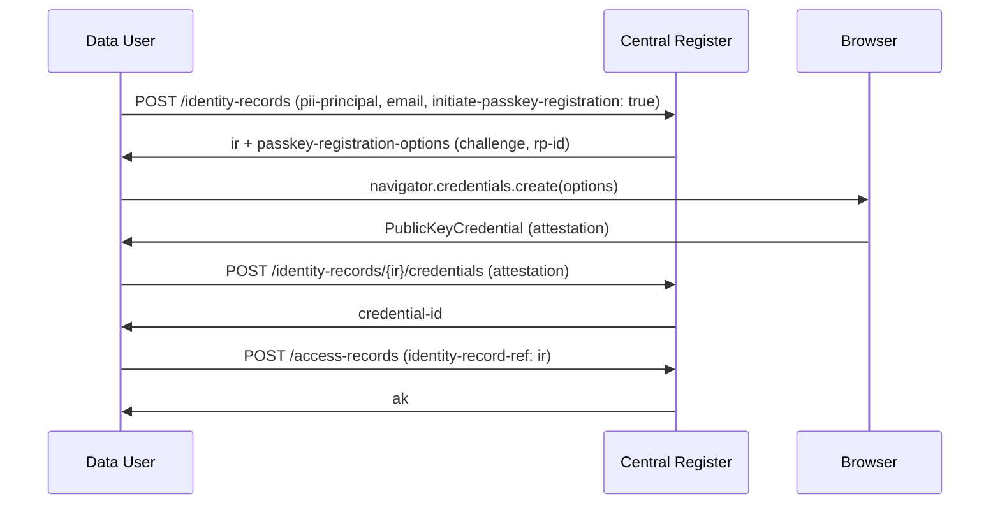
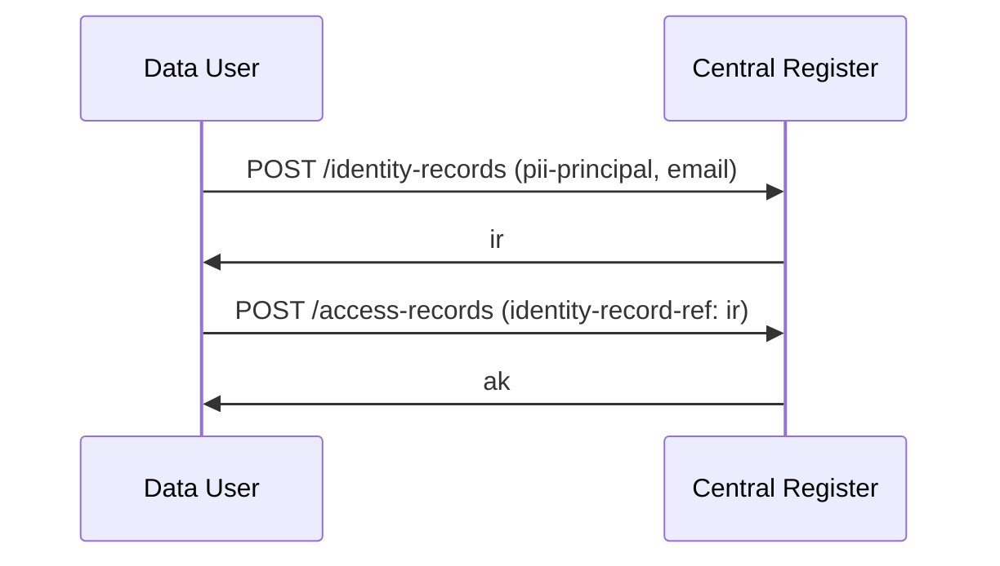
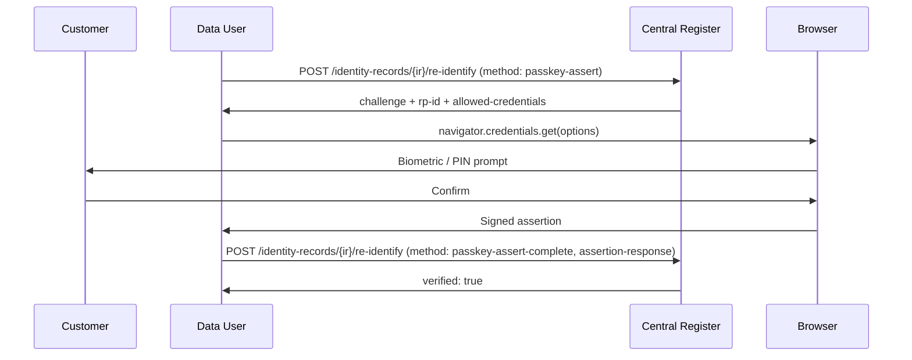
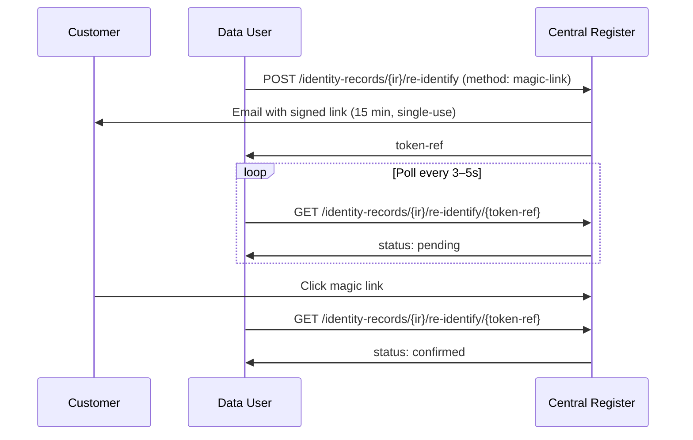
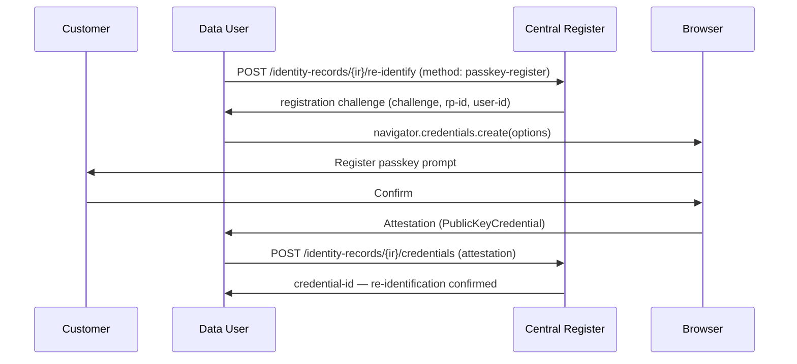

## Overview

An **Identity Record** holds the person-property relationship for a consent or access registration — who the individual is and their occupancy of the meter point. It is intentionally separate from the **Access Record**, which holds only the legal basis, purpose, and data scope.

This separation serves two goals:

1. **Privacy by design** — the unauthenticated `GET /access-records/{ak}` endpoint used by Data Providers to verify access never exposes PII. Identity evidence is accessible only to authenticated Data Users.
2. **Re-identification** — returning customers can be reconnected to their existing Identity Record using a passkey or magic link, without re-collecting all their details from scratch.

## What an Identity Record Holds

| Field | Description |
|-------|-------------|
| `pii-principal` | MPxN, move-in date, and optionally the property address |
| `expressed-by` | Whether consent was given by the data subject or an authorised representative |
| `principal-verification` | How the Controller verified the customer's identity (method, outcome, reference) |
| `email` | Stored as a one-way hash — never returned in plaintext. Enables magic-link re-identification and email-based lookup |
| `credentials` | Registered passkey public keys (metadata only — credential ID, registered-at, transports). Never returned in full |

The `ir` key issued on creation is referenced from `record-metadata.identity-record-ref` on the linked `AccessRecord`.

## Relationship to Access Records

```
AccessRecord
└── record-metadata
    ├── controller          (who is accessing)
    └── identity-record-ref → ir_...
                                │
                          IdentityRecord
                          ├── pii-principal   (MPxN, address, move-in)
                          ├── expressed-by
                          ├── principal-verification
                          ├── email (hashed)
                          └── credentials[]
```

A single Identity Record can be referenced by multiple Access Records — for example if the same customer has given consent to multiple Controllers managed by the same Data User, or if a consent is renewed and a new Access Record is created.

## Creating an Identity Record

Call `POST /identity-records` before registering an Access Record. Supply the `ir` key in `record-metadata.identity-record-ref` when calling `POST /access-records`.

Optionally supply `email` and/or set `initiate-passkey-registration: true` at creation time to enable re-identification from the start.



If you don't need passkey registration at creation time, skip `initiate-passkey-registration` and just use the `ir` key directly:



## Re-identification

When a customer returns — to renew consent, onboard with a new Controller, or access the Customer Portal — the Data User can re-identify them against an existing Identity Record rather than collecting all their details again.

### Step 1: Find the Identity Record

Look up the Identity Record by MPxN or email:

```
GET /identity-records?mpxn=1234567890123
GET /identity-records?email=customer@example.com
```

Email lookup matches against the stored hash. Results are scoped to the authenticated Data User.

### Step 2: Choose a Re-identification Method

Three methods are available, in order of preference:

| Method | When to use | Steps |
|--------|-------------|-------|
| **Passkey assertion** | Customer has a registered passkey on this device | 2-step: get challenge → submit signed assertion |
| **Magic link** | Email stored, no passkey (or new device) | Dispatch link → poll for confirmation |
| **Passkey registration** | No passkey registered — enrol a new one | 2-step: get challenge → submit attestation via `/credentials` |

### Passkey Assertion (returning customer, known device)



### Magic Link (no passkey, or new device)



### Enrolling a New Passkey (passkey-register)

Use `passkey-register` when the customer has no passkey on the record or is using a new device. This issues a registration challenge rather than an assertion challenge. Once the customer completes the ceremony, submit the credential to `POST /identity-records/{ir}/credentials`.



## Managing Credentials

### Adding a Passkey After Creation

If `initiate-passkey-registration` was not set at creation, use `POST /identity-records/{ir}/re-identify` with `method: passkey-register` to obtain a registration challenge, then submit the result to `POST /identity-records/{ir}/credentials`.

### Removing a Passkey

```
DELETE /identity-records/{ir}/credentials/{credentialId}
```

If no credentials remain, passkey re-identification is unavailable. Magic link remains available if an email is stored.

### Multiple Passkeys

A customer may register passkeys on multiple devices — each produces a separate `credential-id`. All are stored on the same Identity Record and any can be used for assertion.

## GDPR Erasure

Identity Records can be anonymised in response to an Art. 17 erasure request. All PII (`pii-principal`, `email`, `credentials`, `principal-verification`) is permanently destroyed. The `ir` key is retained so the linked Access Records remain auditable.

```
DELETE /identity-records/{ir}
```

**Pre-condition:** all Access Records linked to this Identity Record must be in `REVOKED` or `EXPIRED` state. The register returns `409` if any active Access Record would be orphaned.

After anonymisation:
- `GET /identity-records/{ir}` returns the record with all PII fields null and `anonymised-at` set
- `POST /identity-records/{ir}/re-identify` returns `409`
- The linked Access Records remain intact for audit purposes

## Security Notes

**Email is stored as a one-way hash.** The register cannot retrieve the plaintext email address. It is used only for lookup matching and magic-link dispatch routing. It is never returned in any API response.

**Passkey public keys are never returned.** `GET /identity-records/{ir}` returns only credential metadata (ID, registered-at, transports). The public key material is held internally and used only for assertion verification.

**`submitted` in `principal-verification` must always be redacted.** The register must never hold a full card number, account number, or other unredacted sensitive credential. Use masked values such as `XXXX-XXXX-XXXX-4242`.

**Identity Records are scoped to the creating Data User.** A Data User cannot look up or modify Identity Records created by another Data User, even for the same MPxN.

## Change Log

| Version | Date | Summary |
|---------|------|---------|
| 0.0.12 | 2026-03-24 | Identity Records introduced. `pii-principal`, `expressed-by`, and `principal-verification` moved from `AccessRecord` / `ConsentDetails` into a separate `/identity-records` resource. Re-identification via passkey and magic link added. |
