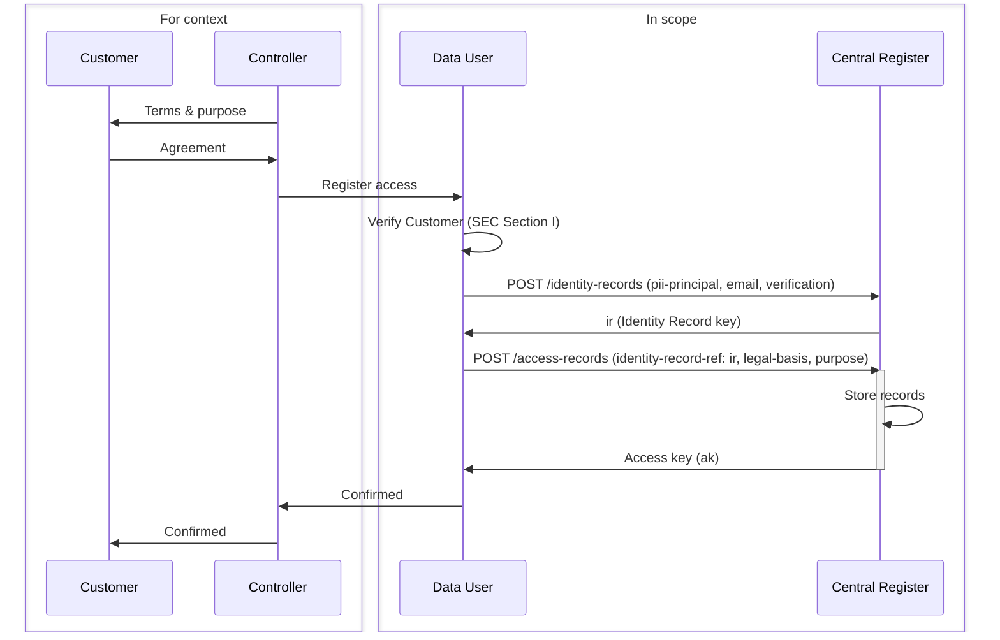
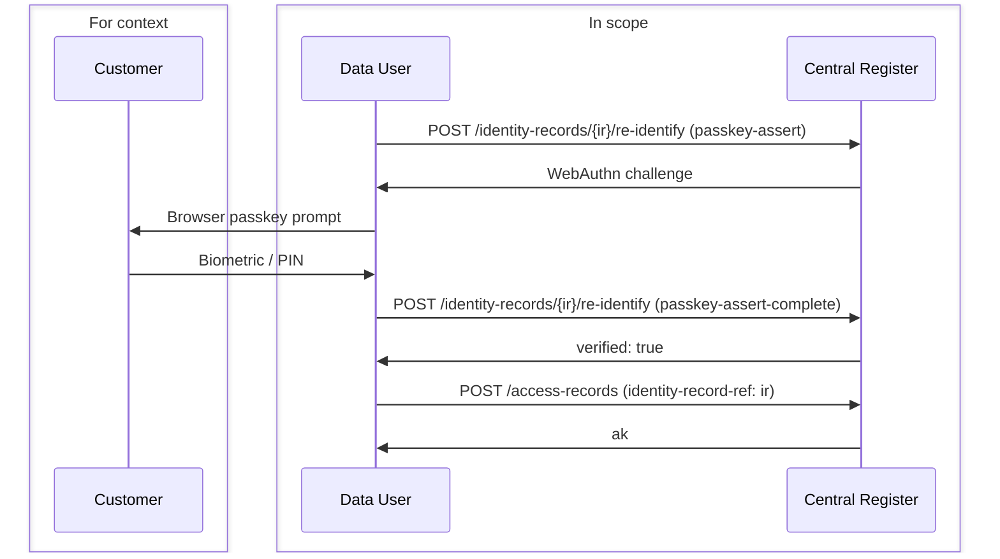
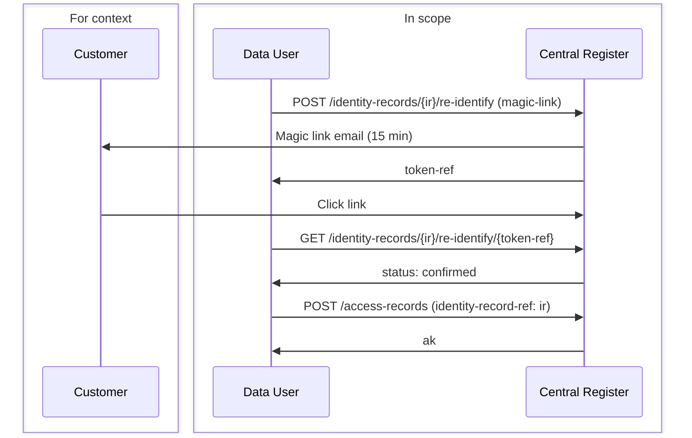
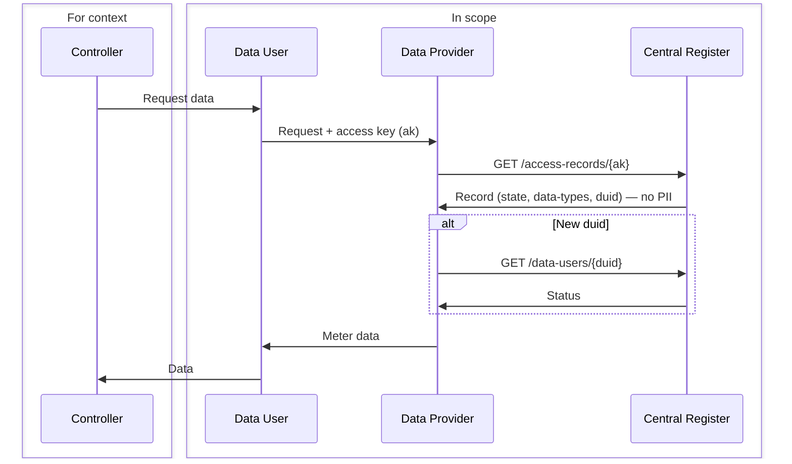
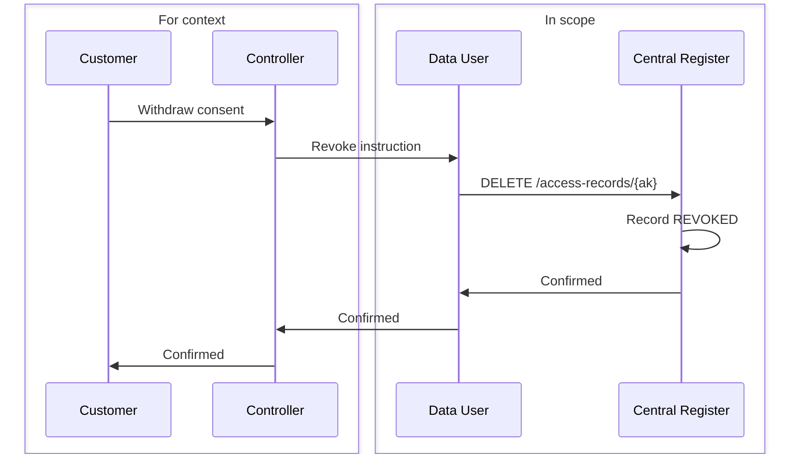
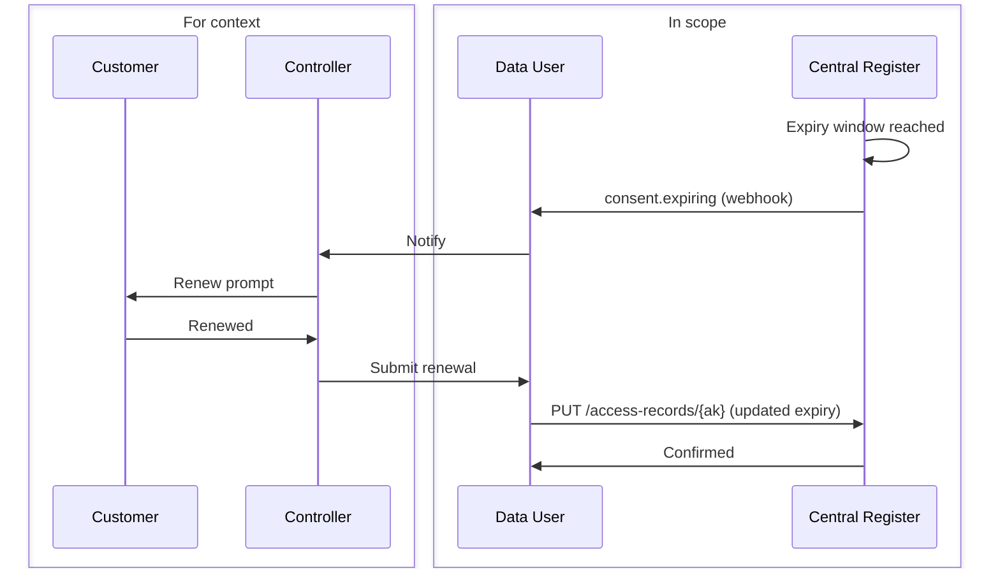
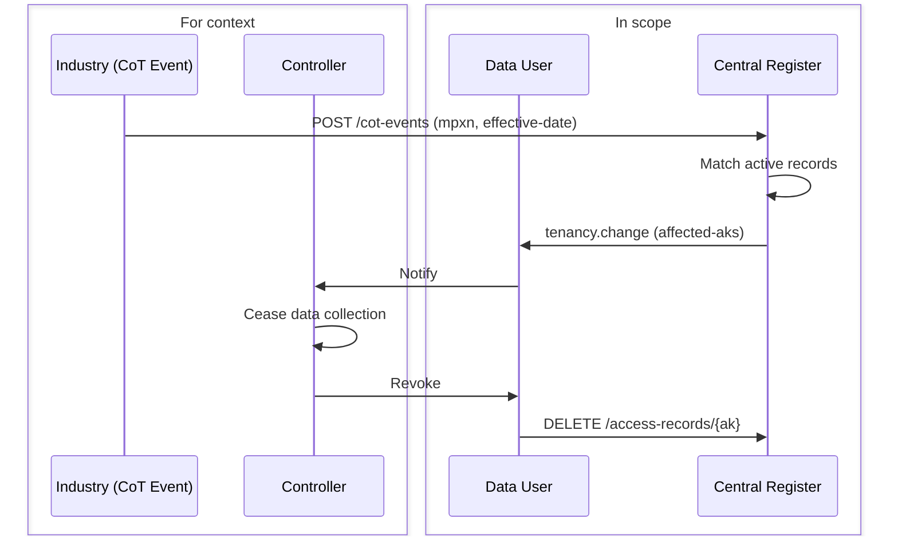

<Warning>
  **This is a design proposal for review and not yet a completed and implementable service.**

  If you wish to discuss the design with the author, please contact us at [contact@auth.energy](mailto:contact@auth.energy)
</Warning>

The register is not a consent register exclusively. It records access under any lawful basis — consent, legitimate interests, public task, legal obligation, or contract. The Central Register holds the registration only; it does not validate or enforce the legal basis claimed by the Controller.

<Info>
  This is a practical, lightweight alternative to the full Consumer Consent Solution architecture. It records all lawful access and is presented as an open design for industry feedback. It also:
- is ISO 27560 compliant
- supports any Customer (not just Consumers)
- supports any approved Identity Verification Scheme
- supports any legal basis (Public Task / Legitimate Interest, Consent, etc)
- automatic capture of discovered access (via DCC transaction logs)
- notifies Data Users of Change of Tenancy events (from DCC via webhook)
- supports a Central Customer Portal as well as allowing consent to be displayed in any customer-facing service
- fully SEC compliant
- supports separate or combined Controllers/Users
- centrally stores identity evidence (faster, more detailed SEC audits — no random sample required)
- new controller/user terms can be automatically discovered and assessed in real time
- historic and expired access can be added to the system at any time
- re-identifies returning customers via passkey or magic link — no re-collection of details required
</Info>

Key flows:
- [Registering an Access Record](#registering-an-access-record)
- [Re-identifying a Returning Customer](#re-identifying-a-returning-customer)
- [Verifying an Access Record](#verifying-an-access-record)
- [Lifecycle Notifications](#lifecycle-notifications)

## Registering an Access Record

The Controller obtains lawful basis from the Customer (or asserts it internally for non-consent bases) and registers it with the Central Register via the Data User API.

Registration is a two-step process:

1. **Create an Identity Record** (`POST /identity-records`) — holds the person-property relationship: MPxN, move-in date, address, identity verification evidence, and optionally an email address and passkey for future re-identification.
2. **Create an Access Record** (`POST /access-records`) — holds the legal basis, purpose, and data scope. References the Identity Record via `identity-record-ref`.

This separation means the unauthenticated verification endpoint used by Data Providers never exposes customer PII.

For consent-based records, the Data User captures the Customer's agreement before calling the register. Identity verification must meet the standard defined in **Smart Energy Code Section I** as approved by the SEC Privacy SubCommittee. The register stores what it is told; it does not re-verify the consent.

Historic records and migrations from existing consent stores can be submitted using the same endpoints.

## Re-identifying a Returning Customer

When a customer returns — to renew consent, onboard with a new Controller, or access the Customer Portal — they can be re-identified against their existing Identity Record using a passkey or magic link. No re-collection of personal details is required.

The Data User first looks up the Identity Record by MPxN or email (`GET /identity-records?mpxn=...`), then initiates the appropriate re-identification method.

### Passkey (preferred — one tap)

### Magic Link (email fallback)

See the [Identity Records guide](/dar/identity-records) for full details including passkey enrolment and credential management.

## Verifying an Access Record

Before releasing meter data, the Data Provider verifies the access key and — on first encounter with a new Data User — looks up the Data User's status in the directory.

<Note>The Data Provider maintains its own independent relationship with the Data User. It may choose to use the verification mechanism described here **OR** to trust the Data User based on their own technical and commercial controls.</Note>

Data Users are registered as **SEC Other Users**. Onboarding, accreditation, and suspension are managed through the SEC Other User process via an administration interface.

The verification response contains no customer PII — identity evidence is held in the Identity Record and accessible only to authenticated Data Users.

The Data Provider is responsible for mapping the `duid` to its own platform access controls. It must deny data release if the access record is not `ACTIVE`, if the access key has expired, or if the Data User's status is `suspended` or `terminated`.

## Lifecycle Notifications

Data Users subscribe to webhook events to manage the access record lifecycle proactively. All events are delivered to the same callback URL; the `event-type` field distinguishes them.

### Consent Withdrawal

A Customer may withdraw consent at any time through the centralised Customer Portal, or through the Data User's own application. When withdrawn via the Data User's application, the Data User calls `DELETE /access-records/{ak}` directly. When withdrawn via the portal, the register fires a `consent.withdrawal` webhook to the Data User immediately after the record is revoked.

<Note>If the Customer withdraws consent through the central portal, the Controller/Data User has the opportunity to engage with the Customer and resolve any issues before data collection ceases entirely.</Note>

### Consent Expiry

Fired when a consent-based access record is within the configured notification window (default 30 days) of its expiry date. The Data User should prompt the Customer to renew before access lapses. Customers can also renew directly via the Customer Portal.

On renewal, the Data User creates a new Access Record (or replaces the existing one via `PUT /access-records/{ak}`) referencing the same `ir`. If the customer is returning after a gap, re-identification via passkey or magic link confirms their identity before the new record is registered.

### Change of Tenancy

The Central Register receives industry Change of Tenancy (CoT) events from the **DCC**. On receipt, it fires a `tenancy.change` webhook to any Data Users with active access records for the affected MPxN. The Data User, as the responsible SEC Other User, must consider this event and potentially cease data collection and revoke their registered records. CoT events from the DCC are occasionally false alerts — Controllers should verify before revoking records held under non-occupancy legal bases (e.g. `uk-public-task`).

No new occupant PII is included in the payload. The affected `ak` values are listed for targeted revocation without requiring a separate list query.

