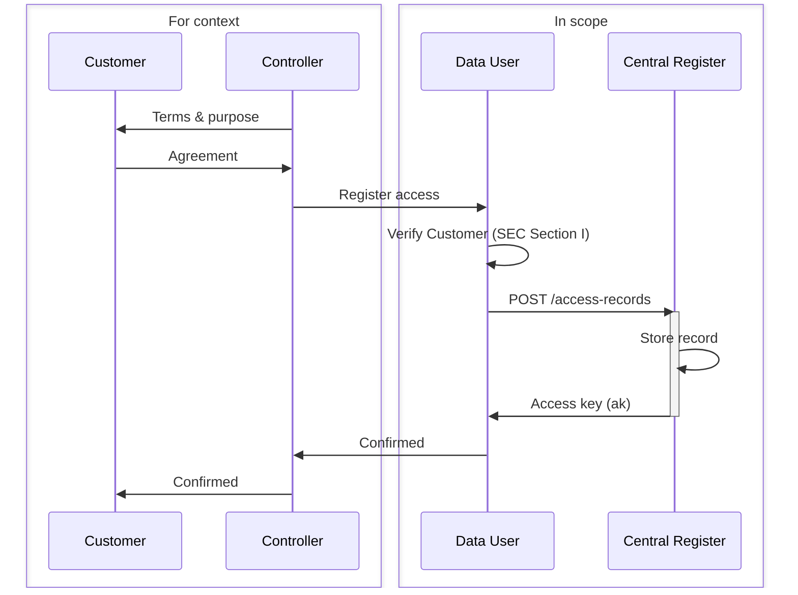
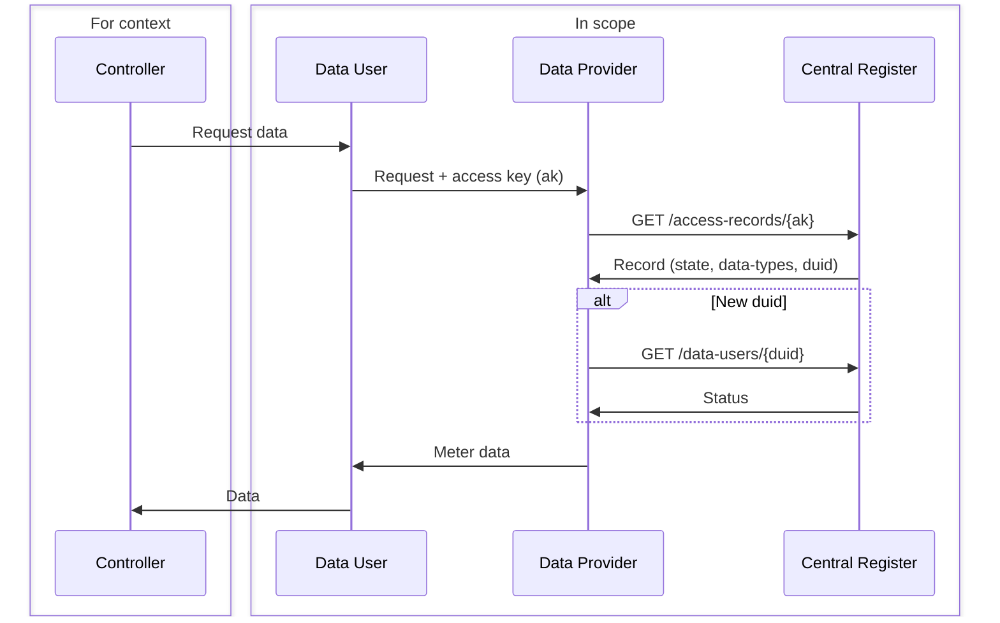
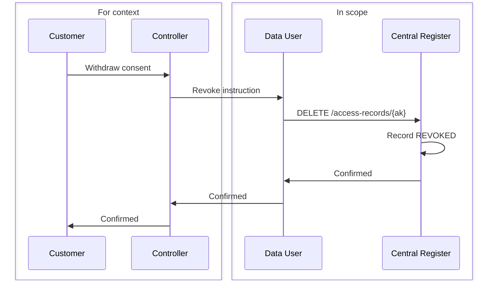
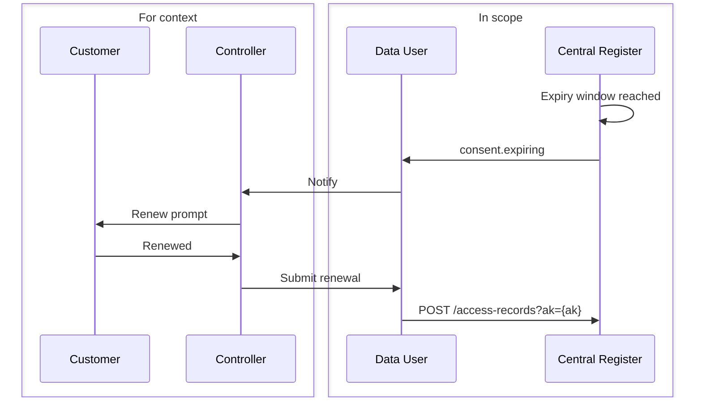
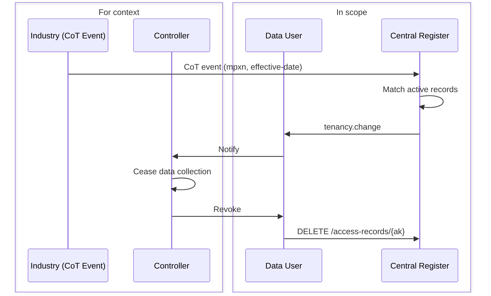

<Info>
  This is a practical, lightweight alternative to the full Consumer Consent Solution architecture. It records all lawful access and is presented as an open design for industry feedback. It also:
- is ISO27650 compliant
- supports any Customer (not just Consumers)
- support any approved Identity Verification Scheme
- supports any legal basis (Public Task / Legitimate Interest, Consent, etc)
- automatic capture of discovered access (via DCC transaction logs)
- supports a Cntral Customer Portal (if required) as well as allowing consent to be displayed in any Customer facing service
- fully SEC compliant
- supports seperate or combined Controllers/Users
- centrally stores evidence (faster, more detailed SEC audits - no random sample required)
</Info>

The register is not a consent register exclusively. It records access under any lawful basis — consent, legitimate interests, public task, legal obligation, or contract. The Central Register holds the registration only; it does not validate or enforce the legal basis claimed by the Controller.

Key flows:
- [Registering an Access Record](#registering-an-access-record)
- [Verifying an Access Record](#verifying-an-access-record)
- [Lifecycle Notifications](#lifecycle-notifications)

## Registering an Access Record

The Controller obtains lawful basis from the Customer (or asserts it internally for non-consent bases) and registers it with the Central Register via the Data User API. The register stores the record and returns an access key.

For consent-based records, the Data User captures the Customer's agreement before calling the register. Identity verification must meet the standard defined in **Smart Energy Code Section I** as approved by the SEC Privacy SubCommittee. The register stores what it is told; it does not re-verify the consent.

Customers can view and revoke their access records at any time via the centralised customer portal or through the Data User's own application.
<Info>The design of the **Centralise Customer Portal** is not included in this technical design</Info>

Historic records and migrations from existing consent stores can be submitted using the same endpoint.

## Verifying an Access Record

Before releasing meter data, the Data Provider verifies the access key and — on first encounter with a new Data User — looks up the Data User's status in the directory.

Data Users are registered as **SEC Other Users**. Onboarding, accreditation, and suspension are managed through the SEC Other User process via an administration interface.

The Data Provider is responsible for mapping the `duid` to its own platform access controls. It must deny data release if the access record is not `ACTIVE`, if the access key has expired, or if the Data User's status is `suspended` or `terminated`.

## Lifecycle Notifications

Data Users can subscribe to webhook events to manage the access record lifecycle proactively. Both events are delivered to the same callback URL; the `event-type` field distinguishes them.

### Consent Withdrawal
A Customer may withdraw consent at any time, either through the centralised customer portal (central initiated event) or through the Data User's own application. Withdrawal flows from the Customer through the Controller and Data User before the register is updated (initiated by Data User).
On receipt of a withdrawal instruction, the Data User must call DELETE /access-records/{ak} immediately. The register transitions the record to REVOKED state and retains it for audit. The Data Provider will deny all subsequent data requests for that access key.
<Note>If the Customer withdraws consent through the central service which they maybe contractually obligated to provide, the Controller/Data User has the opportunity to engage with the Customer and resolve any issues themselves</Note>

### Consent Expiry

Fired when a consent-based access record is within the configured notification window (default 30 days) of its expiry date. The Data User should prompt the Customer to renew before access lapses. Customers can also renew directly via the centralised consumer portal.

### Change of Tenancy

The Central Register receives industry Change of Tenancy (CoT) events from the **DCC**. On receipt, it fires a webhook to any Data Users with active access records for the affected MPxN. The Data User, as the responsible SEC Other User, must consider this event and potentially cease data collection and revoke their registered records (noting CoT events are often false alerts). No new occupant PII is included in the payload.

## Change Log

| Version | Date | Summary |
|---------|------|---------|
| 0.0.9 | 2026-03-18 | Added DCC interface for registering records discovered from their transaction log.| 
| 0.0.8 | 2026-03-18 | Added EDP directory lookup (`GET /data-users/{duid}`) and webhook subscriptions for consent expiry and tenancy change events. |
| 0.0.7 | 2026-03-11 | Initial release. |
