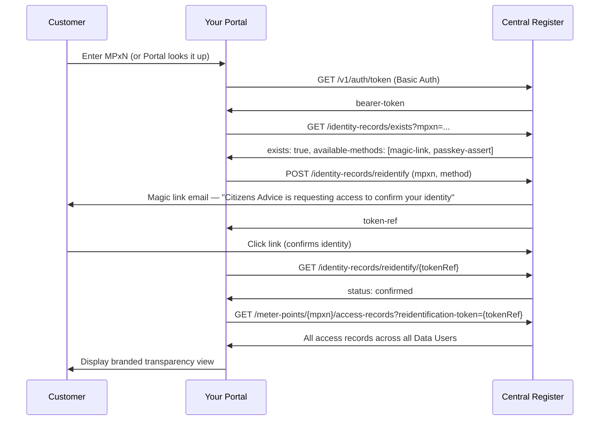

Organisations such as Citizens Advice, consumer charities, Ofgem, or any other body authorised by the SEC can build their own branded transparency portal that shows customers exactly who has access to their energy meter data — across all registered Data Users, not just one supplier.

This is distinct from a Data User showing a customer their own records. A portal operator shows the complete picture.

---

## What a Portal Operator Can Do

A registered portal account can call `GET /meter-points/{mpxn}/access-records` for any MPxN — returning all Data Users' records, discovered access, and record states — provided the customer has actively confirmed their identity via a re-identification challenge.

A portal operator **can**:

- Query any meter point on behalf of a confirmed customer
- Revoke consent-based Access Records on a customer's behalf (the Withdraw action). The register fires a `consent.withdrawal` webhook to the Data User immediately.

A portal operator **cannot**:

- Register or update Access Records — those actions belong to Data Users
- Query a meter point without a confirmed re-identification token
- See PII from Identity Records — only the access summary is returned

---

## Getting Registered

Contact [contact@auth.energy](mailto:contact@auth.energy) to register a portal account. You will receive:

- An `account-id` and `secret-key`
- A `duid` identifying your organisation
- The `portal` role — which enables cross-MPxN queries

Your `display-name` will be shown to customers during the re-identification challenge, so use your organisation's public-facing name.

---

## The Full Flow



---

## Step-by-Step Implementation

### 1. Authenticate

Exchange your credentials for a bearer token:

```bash
curl -s -u portal_ops:your-secret-key \
  https://api.central.consent/v1/auth/token
```

Tokens are valid for 7200 seconds. Your application should cache and refresh them.

### 2. Check Identity Record Existence

Before initiating re-identification, check whether an Identity Record exists for the customer's MPxN and which methods are available:

```bash
curl -s -H "Authorization: Bearer $TOKEN" \
  "https://api.central.consent/v1/identity-records/exists?mpxn=2312345678901"
```

Response:

```json
{
  "exists": true,
  "mpxn": "2312345678901",
  "available-methods": ["magic-link", "passkey-assert", "passkey-register"]
}
```

If `exists` is `false`, the customer has not yet registered with any Data User. You may still display publicly available information, but no records will be returned from the meter-point query.

### 3. Initiate Re-identification

Initiate the re-identification challenge. Choose the best available method — prefer `passkey-assert` if available, fall back to `magic-link`:

```bash
curl -s -X POST \
  -H "Authorization: Bearer $TOKEN" \
  -H "Content-Type: application/json" \
  -d '{"mpxn": "2312345678901", "method": "magic-link"}' \
  https://api.central.consent/v1/identity-records/reidentify
```

The register sends the customer a magic link email (or redirects them to a passkey prompt) showing your organisation's `display-name`. The customer sees:

> *"Citizens Advice is requesting access to confirm your identity with the Central Access Register."*

Response:

```json
{
  "method": "magic-link",
  "magic-link": {
    "dispatched-to": "c*****r@example.com",
    "token-ref": "mlr_9f8e7d6c5b4a...",
    "expires-at": "2026-03-25T11:15:00Z"
  }
}
```

### 4. Poll for Confirmation

Poll until the customer confirms or the token expires:

```bash
curl -s -H "Authorization: Bearer $TOKEN" \
  "https://api.central.consent/v1/identity-records/reidentify/mlr_9f8e7d6c5b4a..."
```

Poll every 3–5 seconds. Possible statuses:

| Status | Meaning |
|---|---|
| `pending` | Customer has not yet clicked the link |
| `confirmed` | Customer has confirmed — proceed to step 5 |
| `expired` | Link expired (15 min) — restart from step 3 |

### 5. Query the Meter Point

Once confirmed, use the `token-ref` as a query parameter:

```bash
curl -s \
  -H "Authorization: Bearer $TOKEN" \
  "https://api.central.consent/v1/meter-points/2312345678901/access-records?reidentification-token=mlr_9f8e7d6c5b4a..."
```

The token is **single-use and consumed on this call**. A new re-identification is required for each portal session.

Response: the full `ListAccessRecordsResponse` — all Data Users' records, discovered access, all states.

---

## Displaying the Results

The `access-records` array contains `AccessRecordSummary` objects. Key fields for a transparency view:

| Field | Use |
|---|---|
| `lead-controller-name` | Organisation name to display |
| `state` | `ACTIVE`, `REVOKED`, `EXPIRED`, `DISCOVERED` |
| `legal-basis` | Plain-language label (see below) |
| `data-types` | What data is being accessed |
| `expiry` | When consent expires — may be null |
| `record-metadata.controller-arrangement` | Full controller list for joint/group arrangements |
| `record-metadata.controller-arrangement.controllers[].privacy-rights-url` | Link to privacy policy / rights page |
| `discovered-access` | Present when `state` is `DISCOVERED` — organisation name, SEC reference, first/last seen |

**Legal basis plain-language labels:**

| Value | Display text |
|---|---|
| `uk-consent` | You gave permission |
| `uk-explicit-consent` | You gave explicit permission |
| `uk-legitimate-interests` | Legitimate business interest |
| `uk-public-task` | Public or regulatory duty |
| `uk-legal-obligation` | Legal obligation |
| `uk-contract` | Contract |

---

## Handling the DISCOVERED State

Records with `state: DISCOVERED` represent organisations the DCC has detected accessing meter data without having registered with the DAR. These are not Access Records — they have no legal basis on file.

Display these prominently. The `discovered-access.organisation-reference` field contains the SEC Other User reference (e.g. `SEC-OU-00429`) which customers can use to report concerns to the Smart Energy Code Administrator.

---

## Re-identification and Customer Trust

The re-identification flow is designed so the customer always knows who is asking for access to their data:

- **Magic link** — the email is sent from `no-reply@central.consent` and names your organisation in the body
- **Passkey** — the challenge page at `id.central.consent` displays your `display-name` before the biometric prompt

Your organisation's `display-name` comes from the registered account profile. It cannot be spoofed by the caller — the register reads it from your account record internally.

---

## Security Constraints

- A `reidentification-token` is **single-use** — it is consumed when `GET /meter-points/{mpxn}/access-records` is called. A new token is required for each session.
- Tokens expire **one hour** after issuance. If the customer takes longer than an hour to confirm, restart the flow.
- A portal account cannot query a meter point without a valid confirmed token. Bulk or automated queries without customer presence are not possible.
- Portal accounts cannot register, modify, or revoke Access Records. These actions are reserved for `data_user` accounts.

---

## Demo Credentials

The reference implementation includes a pre-registered portal account:

| Field | Value |
|---|---|
| Account ID | `portal_ops` |
| Secret Key | `portal-secret-demo` |
| Role | `portal` |

The demo portal at `http://localhost:5001/portal` uses this account by default. Re-identification is stubbed — tokens auto-confirm immediately without dispatching real emails or passkey challenges.
